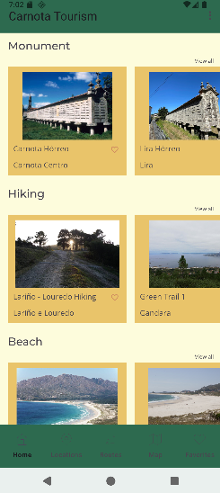
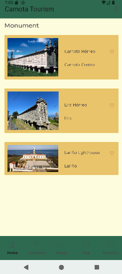
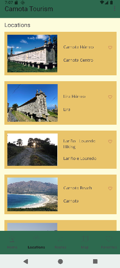
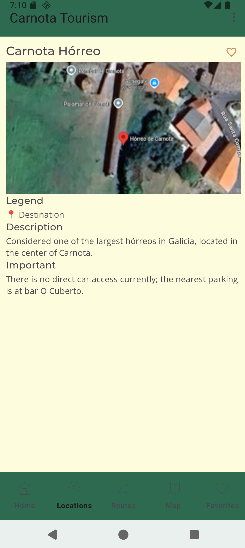
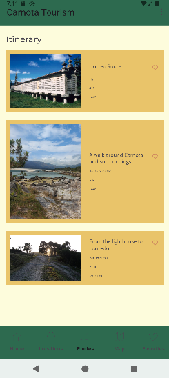
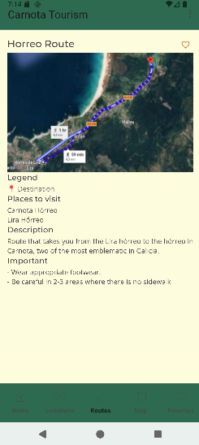
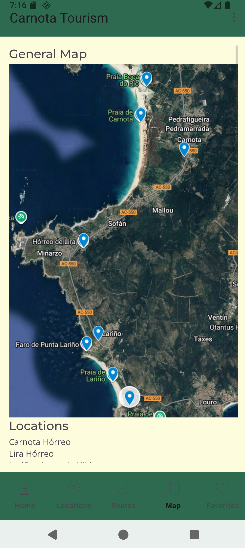
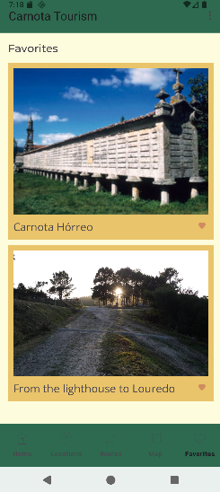
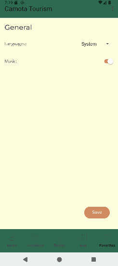
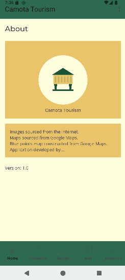

# Manual de usuario

## Inicio
Inicio componse de unha lista de puntos de interes ordenados polo tipo (plaia, monumento...)

Como se pode observar na imaxe, cada fila horizontal mostra os distintos monumentos de un tipo, por exemplo, a primeira fila podense ver os distintos monumentos

Tambien se dispone de un botón de añadir favoritos con forma de corazón, que permite añadir a la vista de favoritos el punto de interés que desees.

## Ver todo
Si en la pantalla previa clickas en ver todo te lleva a una nueva ventana donde se muestran todos las ubicaciones de interes de un mismo tipo como pueden ser monumentos, playas, etc.
Tienes acceso a un botón con un corazon para añadir a la vista de favoritos el punto de interés que desees.

## Puntos de interes/Localizaciones
Esta sección muestra todos los puntos de interés que se almacenan en la aplicación, con su nombre, dirrección e imaxe. Ao clickar podes ver en detalle un punto de interés (esto tamen aplica as sección anteriores).
Tamén se dispon do botón de añadir e remover de favoritos.

## Detalles de un punto de interés
Esta sección muestra toda la información de interes sobre un punto de interés, como su nombre, ubicación, imagen satelital, datos de inters...

## Rutas
Esta sección muestra todas las rutas que se almacenan en la aplicación.
Se pueden también marcar en favoritos las rutas que desees.
Ao clickar en unha ruta podes acceder a ela para ver os seus detalles, como o nome, distancia, temopo estimado...

## Detalles de una ruta
Esta sección muestra toda la información relativa a una ruta, como su nombre, distancia, tiempo estimado...

## Mapa general
Esta sección muestra un mapa general con todos los puntos de interés ubicados sobre un mapa.

## Favoritos
Esta sección muestra todos los puntos de interés y rutas que tienes marcado como favoritos. Ao clickar en un punto de interés o ruta puedes acceder a sus detalles.

## Ajustes
Esta sección permite al usuario cambiar el tema de la aplicación y gestionar el idioma de la misma.

## Sobre

Muestra información sobre la aplicación, como su versión, desarrolladores, etc.

